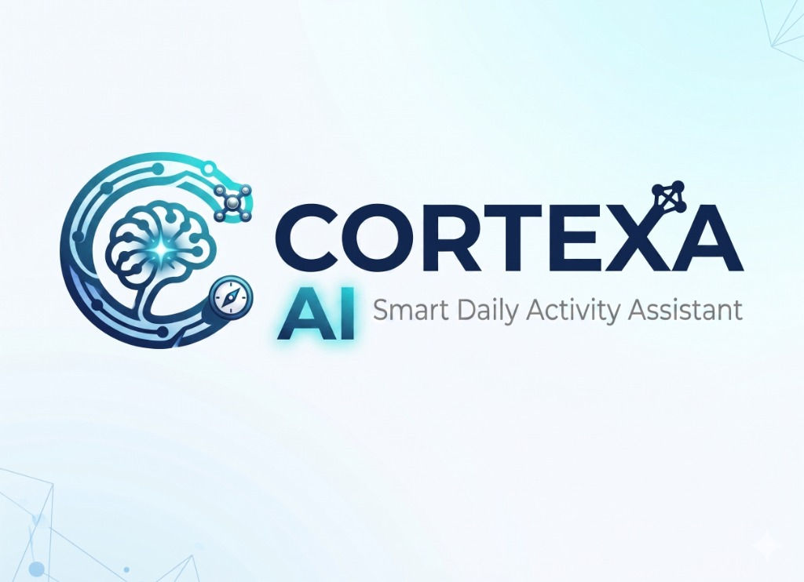

<p align="center">
  
</p>

<h1 align="center">Cortexa AI</h1>

<p align="center">
  <strong>Your life, understood.</strong><br/>
  An autonomous AI life assistant that transforms your digital footprint into searchable, actionable intelligence.
</p>

<p align="center">
  <a href="https://cortexa.doptonin.online">🌐 Live Demo</a> · 
  <a href="https://expo.dev/artifacts/eas/dAQbFcSh4jhnkmAJtxtg7g.apk">📱 Download APK</a>
</p>

---

## ✨ What is Cortexa?

Cortexa AI is a full-stack personal intelligence platform that uses LLMs to understand natural language and autonomously manage your:

- **💰 Finances** — Track income & expenses with plain English. _"I spent ₹500 on groceries yesterday."_
- **🧠 Memory** — Store and retrieve anything. _"Remember that my WiFi password is Nebula42."_
- **⏰ Reminders** — Context-aware scheduling. _"Remind me to call the dentist tomorrow at 3pm."_
- **📊 Analytics** — AI-powered dashboards with spending breakdowns, weekly trends, and category insights.

All through a single conversational interface — no forms, no buttons, just talk.


## 🚀 Features

- 🗣️ **Natural Language Processing** — No forms. Just type what you want in plain English or Hindi.
- 🤖 **Multi-Agent Orchestrator** — Automatically routes your input to the right AI agent (finance, memory, reminder, or query).
- 📈 **Financial Dashboard** — Real-time charts, category breakdowns, weekly spending trends.
- 🧠 **Persistent Memory** — AI remembers everything you tell it and recalls on demand.
- 🔔 **Smart Reminders** — Time-based and contextual reminders with push notifications.
- 🔒 **Secure Auth** — Clerk-based authentication with JWT verification on every request.
- 💳 **Subscription Billing** — 8-tier pricing with Cashfree payment gateway, promo codes, and one-time payments.
- 📱 **Cross-Platform** — Web app + native Android app with shared API.
- 🛡️ **Admin Panel** — User management, analytics, promo code management, and system monitoring.
- 🎤 **Voice Input** — Speak instead of type (Pro plans and above).

## 📦 Project Structure

```
├── backend/            # FastAPI server
│   ├── agents/         # AI agent implementations
│   ├── orchestrator/   # Multi-agent routing logic
│   ├── routes/         # API endpoints
│   ├── services/       # Business logic
│   ├── db/             # Database models & migrations
│   └── plans.py        # Subscription tier definitions
│
├── frontend/           # Next.js web application
│   ├── app/            # App router pages
│   ├── components/     # Reusable UI components
│   └── lib/            # API client & utilities
│
└── mobile/             # React Native (Expo) app
    ├── app/            # Expo Router screens
    ├── components/     # Mobile UI components
    └── lib/            # Shared API client
```

## 🛠️ Getting Started

### Prerequisites

- Python 3.11+
- Node.js 18+
- PostgreSQL
- Clerk account (auth)
- OpenAI API key

### Backend

```bash
cd backend
python -m venv .venv
.venv\Scripts\activate        # Windows
# source .venv/bin/activate   # macOS/Linux
pip install -r requirements.txt
cp .env.example .env          # Fill in your keys
uvicorn main:app --reload --host 127.0.0.1 --port 6060
```

**Required `.env` variables:**
- `DATABASE_URL` — PostgreSQL connection string
- `OPENAI_API_KEY` — For LLM orchestration
- `CLERK_JWKS_URL` — From Clerk Dashboard → API Keys → JWT Verification
- `CLERK_ISSUER` — Must match the JWT `iss` claim
- `CASHFREE_CLIENT_ID` / `CASHFREE_CLIENT_SECRET` — For payment processing

### Frontend

```bash
cd frontend
npm install
cp .env.local.example .env.local  # Set Clerk keys
npm run dev                        # → http://localhost:3006
```

### Mobile

```bash
cd mobile
npm install
npx expo start
# Or build APK:
npx eas-cli build --platform android --profile preview
```

## 🔐 Security

- API **never** trusts `user_id` from the client — JWT `sub` claim is the sole source of truth.
- All sensitive operations require `Authorization: Bearer <Clerk JWT>` headers.
- Cashfree webhook signatures are verified using HMAC-SHA256.
- If API keys are ever exposed, rotate them immediately in Clerk and hosting secrets.

## 📄 License

Private repository. All rights reserved.

---

<p align="center">
  Built with ❤️ by <a href="https://github.com/prince-1104">prince-1104</a>
</p>
