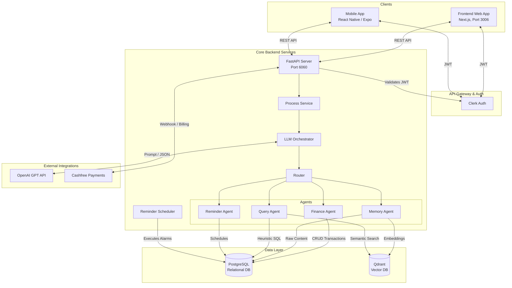
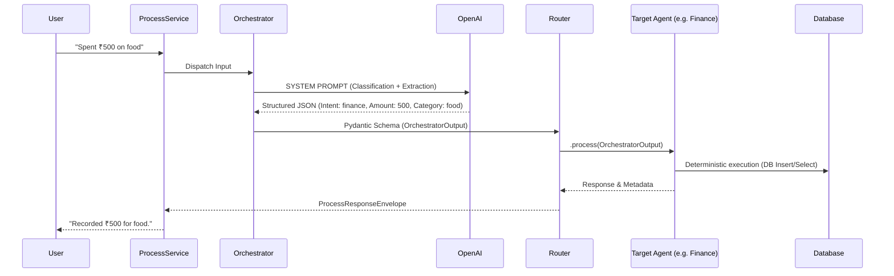

# TrackerAgent System Architecture

This document outlines the high-level architecture and system design for **TrackerAgent** (also known as Cortexa AI), a multi-agent personal life assistant platform.

---

## 1. System Overview

TrackerAgent is a full-stack, cross-platform intelligent assistant that processes natural language inputs to autonomously manage finances, memories, queries, and reminders. The system relies on a single-prompt orchestrator to classify intents and extract payloads, which are then routed to specialized agents for deterministic execution.

### High-Level Architecture Diagram



---

## 2. Technology Stack

| Layer | Technology | Purpose |
|-------|-----------|---------|
| **Frontend** | Next.js 14, React, TailwindCSS | Web client with Server-Side Rendering (SSR) & App Router. |
| **Mobile** | React Native, Expo, EAS | Native Android/iOS client sharing the same API. |
| **Backend** | Python 3.11+, FastAPI, Uvicorn | High-performance async API server. |
| **Database (Relational)** | PostgreSQL, SQLAlchemy (Async) | Storing users, finances, raw logs, reminders. |
| **Database (Vector)** | Qdrant | Storing and semantic searching of memories and contexts. |
| **Authentication** | Clerk | JWT-based secure authentication (Web & Mobile). |
| **AI/LLM** | OpenAI API (`AsyncOpenAI`) | Natural Language Processing and Orchestration. |
| **Payments** | Cashfree Payments | Subscription billing and UPI support. |

---

## 3. Core Workflow: AI Orchestration & Agents

TrackerAgent minimizes LLM latency and costs by utilizing a **Single-Prompt Classification & Extraction** pipeline.



### Agents Breakdown

1. **Finance Agent (`finance_agent.py`)**
   - **Role:** Logs income and expenses.
   - **Logic:** Relies on the Orchestrator to extract `amount`, `transaction_type`, `category`, and `source`. Falls back to Regex if needed. Saves directly to PostgreSQL.

2. **Memory Agent (`memory_agent.py`)**
   - **Role:** Saves facts, notes, and context.
   - **Logic:** Receives `content` and `tags` directly from the Orchestrator. Saves raw data to PostgreSQL and embeds vectors into Qdrant.

3. **Query Agent (`query_agent.py`)**
   - **Role:** Re-surfaces data and answers queries.
   - **Logic:** 
     - Evaluates queries for precise numerical/financial intent (e.g., "top spending categories") and executes heuristic PostgreSQL queries.
     - For non-financial queries, executes semantic vector search via Qdrant and ranks results.

4. **Reminder Agent (`reminder_agent.py`)**
   - **Role:** Handles task scheduling and alerts.
   - **Logic:** Uses the Orchestrator's extracted `task` and `time`. An internal `reminder_scheduler.py` runs periodically to execute and dispatch alarms based on user timezones.

---

## 4. Security & Authentication

- **Zero-Trust Backend:** The backend API never trusts the `user_id` passed from the client payload. 
- **Clerk JWT:** The JWT `sub` claim is validated on every single protected route via `Authorization: Bearer <Clerk JWT>`.
- **Tenant Isolation:** All database queries are explicitly scoped by the `user_id` derived from the validated JWT token.
- **Webhook Verification:** Incoming webhooks from Cashfree (Payments) are verified using HMAC-SHA256 signatures to prevent malicious injections.

---

## 5. System Logging & Telemetry

To improve agent accuracy and monitor system health, all steps in the orchestration pipeline are logged asynchronously:

- **`log_orchestrator_step`**: Records the LLM prompt, response JSON, and latency (ms).
- **`log_agent_step`**: Records agent-specific deterministic actions, queries performed, and execution latency.
- **`log_error` / `log_query`**: Tracks anomalies and final response payloads returned to the client.

---

## 6. Project Structure Mapping

```text
TrackerAgent/
├── backend/            # FastAPI Async Server
│   ├── agents/         # Specific agent logic (Finance, Memory, Query, Reminder)
│   ├── orchestrator/   # Single-prompt routing and classification
│   ├── routes/         # HTTP API Controllers
│   ├── services/       # Core business logic & scheduling
│   ├── db/             # Models, Migrations, Postgres/Qdrant connection pools
│   └── plans.py        # Subscription tier definitions
│
├── frontend/           # Next.js 14 App Router
│   ├── app/            # Pages, API routes, Layouts
│   ├── components/     # UI Components (Tailwind)
│   └── lib/            # Utilities & Axios Clients
│
└── mobile/             # React Native App
    ├── app/            # Expo Router Screens
    ├── components/     # Mobile UI Components
    └── lib/            # Shared utilities
```
